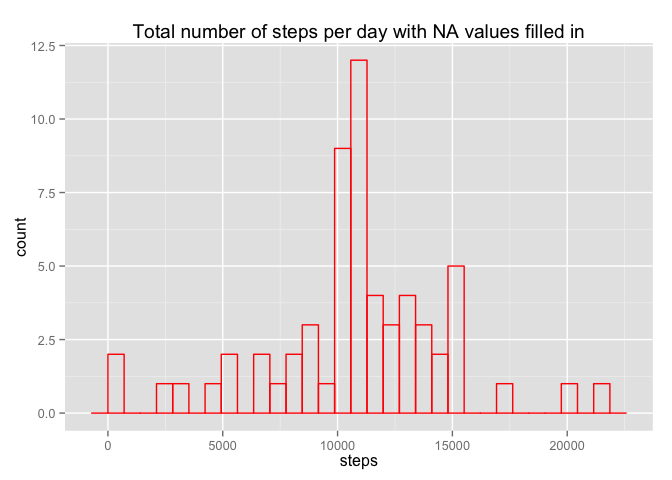
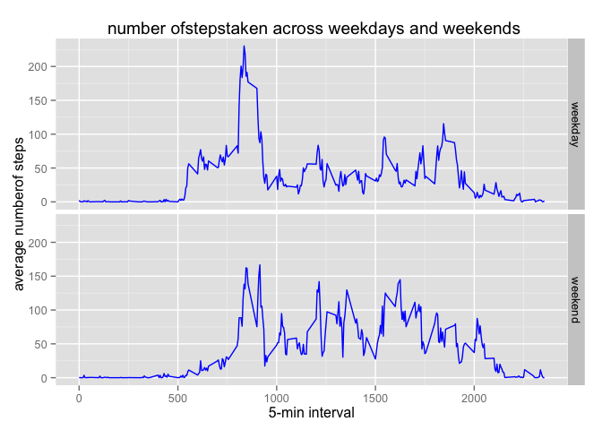

# Reproducible Research: Peer Assessment 1


## Loading and preprocessing the data

```r
setwd("/Users/himabindu/repdata_peerassg1")
library(knitr)
library(ggplot2)
library(dplyr)
unzip("activity.zip")
filename<-read.csv("activity.csv",header = TRUE,sep=",") ## reading the file
```

## What is mean total number of steps taken per day?

```r
steps_per_day<-aggregate(steps~date,filename,FUN = sum)
```
Plotting the histogram for the total number of steps

```r
ggplot(steps_per_day,aes(steps)) +geom_histogram(fill=NA, color="blue") + labs(title="Total number of steps per day")        +labs(x="steps")
```

```
## stat_bin: binwidth defaulted to range/30. Use 'binwidth = x' to adjust this.
```

 

```r
mean(steps_per_day$steps) ## calculating the mean
```

```
## [1] 10766
```

```r
median(steps_per_day$steps)
```

```
## [1] 10765
```

## What is the average daily activity pattern?

```r
steps_per_interval<-aggregate(steps~interval,filename,FUN=mean,na.rm = TRUE)
names(steps_per_interval)[2]<-"averagesteps"
```
Making a time series plot

```r
plot(steps_per_interval$interval,steps_per_interval$averagesteps,type="l",xlab="5 min interval",ylab ="Average number of steps",main="Average Daily Activity in a 5 min interval")
```

 

```r
maxinterval<-steps_per_interval[which.max(steps_per_interval$averagesteps),] ## finding the maximum interval
```

## Imputing missing values

```r
sum(is.na(filename)) ## finding the numv=ber of NA's
```

```
## [1] 2304
```

```r
data<-merge(filename,steps_per_interval,by.x="interval") ## merging the original file and average steps perinterval file
data<-data[(order(data$date,data$interval)),]  ## ordering it by date and interval
rownames(data)<-NULL   
for(i in 1:nrow(data))
{
   if(is.na(data$steps[i])) {
     data$steps[i]<-data$averagesteps[i]
     }
}
newdata<-select(data,steps,date,interval) ## selecting the required number of columns
```
Calculating the mean and median

```r
new_steps_per_day<-aggregate(steps~date,newdata,FUN = sum)
mean(new_steps_per_day$steps)
```

```
## [1] 10766
```

```r
median(new_steps_per_day$steps)
```

```
## [1] 10766
```
Yes , the values differ slightly.looking at the means and medians before and after filling the NA values ,thtey look same.

Plotting a histogram for the data with  NA values are filled in

```r
ggplot(new_steps_per_day,aes(steps)) +geom_histogram(fill=NA, color="red") + labs(title="Total number of steps per day with NA values filled in")
```

```
## stat_bin: binwidth defaulted to range/30. Use 'binwidth = x' to adjust this.
```

 


## Are there differences in activity patterns between weekdays and weekends?

```r
newdata$date<-as.Date(newdata$date,format="%Y-%m-%d") ## converting to the Date class
newdata$day<-factor(format(newdata$date,"%A")) ## converting the dates to days and creating a factor variable
levels(newdata$day)<-list(weekday = c("Monday","Tuesday","Wednesday","Thursday","Friday") ,
                           weekend = c("Saturday","Sunday"))
averagesteps<-aggregate(steps~interval + day,newdata,FUN=mean) ## aggregating the total number of steps 
```
Plotting the panel plot for steps on weekdaya and weekends

```r
ggplot(averagesteps,aes(interval,steps))+geom_line(color="blue") + facet_grid(day~.) +
labs(title=" number ofstepstaken across weekdays and weekends") +labs(x = "5-min interval") +labs(y="average numberof steps ")
```

 


