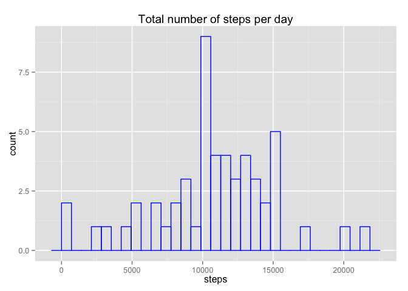
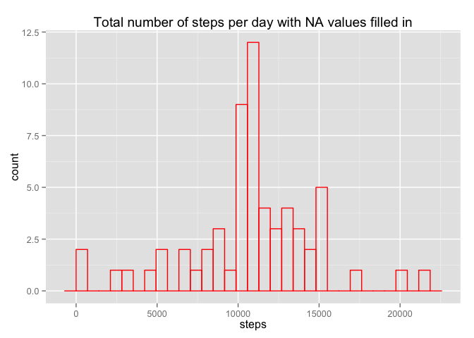
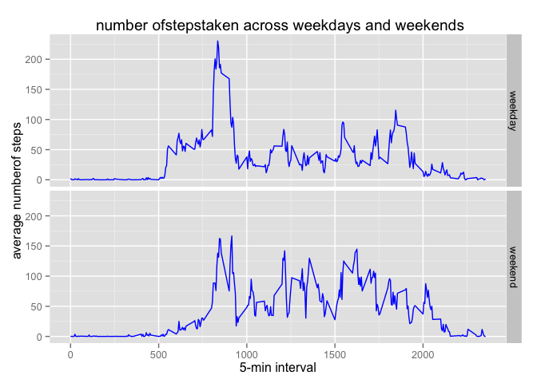

# Reproducible Research: Peer Assessment 1


## Loading and preprocessing the data


```r
library(knitr)
library(ggplot2)
library(dplyr)
unzip("activity.zip")
filename<-read.csv("activity.csv",header = TRUE,sep=",") ## reading the file
```

## What is mean total number of steps taken per day?

```r
steps_per_day<-aggregate(steps~date,filename,FUN = sum)
```

1.Make a histogram of the total number of steps taken each day

```r
ggplot(steps_per_day,aes(steps)) +geom_histogram(fill=NA, color="blue") + labs(title="Total number of steps per day")        +labs(x="steps")
```

```
## stat_bin: binwidth defaulted to range/30. Use 'binwidth = x' to adjust this.
```

 

2.Calculate and report the mean and median total number of steps taken per day

```r
mean(steps_per_day$steps) ## calculating the mean
```

```
## [1] 10766
```

```r
median(steps_per_day$steps)
```

```
## [1] 10765
```

## What is the average daily activity pattern?

1.Make a time series plot (i.e. type = "l") of the 5-minute interval (x-axis) and the average number of steps taken, averaged across all days (y-axis)

```r
steps_per_interval<-aggregate(steps~interval,filename,FUN=mean,na.rm = TRUE)
names(steps_per_interval)[2]<-"averagesteps"
```
Here is the plot

```r
plot(steps_per_interval$interval,steps_per_interval$averagesteps,type="l",xlab="5 min interval",ylab ="Average number of steps",main="Average Daily Activity in a 5 min interval")
```

 

2.Which 5-minute interval, on average across all the days in the dataset, contains the maximum number of steps?

```r
maxinterval<-steps_per_interval[which.max(steps_per_interval$averagesteps),] ## finding the maximum interval
maxinterval
```

```
##     interval averagesteps
## 104      835        206.2
```
The average number of steps are 206.1698.And the 835 th interval contains these maximum number of steps..

## Imputing missing values

1.Calculate and report the total number of missing values in the dataset (i.e. the total number of rows with NAs)

```r
  total<-sum(is.na(filename))
  total
```

```
## [1] 2304
```
The total number of NA's in the dataset are 2304.

2.Devise a strategy for filling in all of the missing values in the dataset. The strategy does not need to be sophisticated. For example, you could use the mean/median for that day, or the mean for that 5-minute interval, etc.

```r
data<-merge(filename,steps_per_interval,by.x="interval") ## merging the original file and average steps perinterval file
data<-data[(order(data$date,data$interval)),]  ## ordering it by date and interval
rownames(data)<-NULL   
for(i in 1:nrow(data))
{
   if(is.na(data$steps[i])) {
     data$steps[i]<-data$averagesteps[i]
     }
}
```

3.Create a new dataset that is equal to the original dataset but with the missing data filled in.

```r
  newdata<-select(data,steps,date,interval) ## selecting the required number of columns
```

4.Make a histogram of the total number of steps taken each day and Calculate and report the mean and median total number of steps taken per day. Do these values differ from the estimates from the first part of the assignment? What is the impact of imputing missing data on the estimates of the total daily number of steps?


```r
new_steps_per_day<-aggregate(steps~date,newdata,FUN = sum)
mean(new_steps_per_day$steps)
```

```
## [1] 10766
```

```r
median(new_steps_per_day$steps)
```

```
## [1] 10766
```
Yes , the values differ slightly.looking at the means and medians before and after filling the NA values ,thtey look same.

Plotting a histogram for the data with  NA values are filled in

```r
ggplot(new_steps_per_day,aes(steps)) +geom_histogram(fill=NA, color="red") + labs(title="Total number of steps per day with NA values filled in")
```

```
## stat_bin: binwidth defaulted to range/30. Use 'binwidth = x' to adjust this.
```

 

## Are there differences in activity patterns between weekdays and weekends?

1.Create a new factor variable in the dataset with two levels – “weekday” and “weekend” indicating whether a given date is a weekday or weekend day.

```r
newdata$date<-as.Date(newdata$date,format="%Y-%m-%d") ## converting to the Date class
newdata$day<-factor(format(newdata$date,"%A")) ## converting the dates to days and creating a factor variable
levels(newdata$day)<-list(weekday = c("Monday","Tuesday","Wednesday","Thursday","Friday") ,
                           weekend = c("Saturday","Sunday"))
```

2.Make a panel plot containing a time series plot (i.e. type = "l") of the 5-minute interval (x-axis) and the average number of steps taken, averaged across all weekday days or weekend days (y-axis). See the README file in the GitHub repository to see an example of what this plot should look like using simulated data.

```r
averagesteps<-aggregate(steps~interval + day,newdata,FUN=mean) ## aggregating the total number of steps 
```
Plotting the panel plot for steps on weekdaya and weekends

```r
ggplot(averagesteps,aes(interval,steps))+geom_line(color="blue") + facet_grid(day~.) +
labs(title=" number ofstepstaken across weekdays and weekends") +labs(x = "5-min interval") +labs(y="average numberof steps ")
```

 


